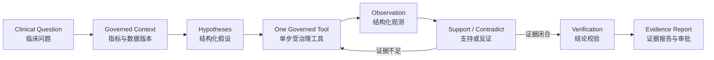
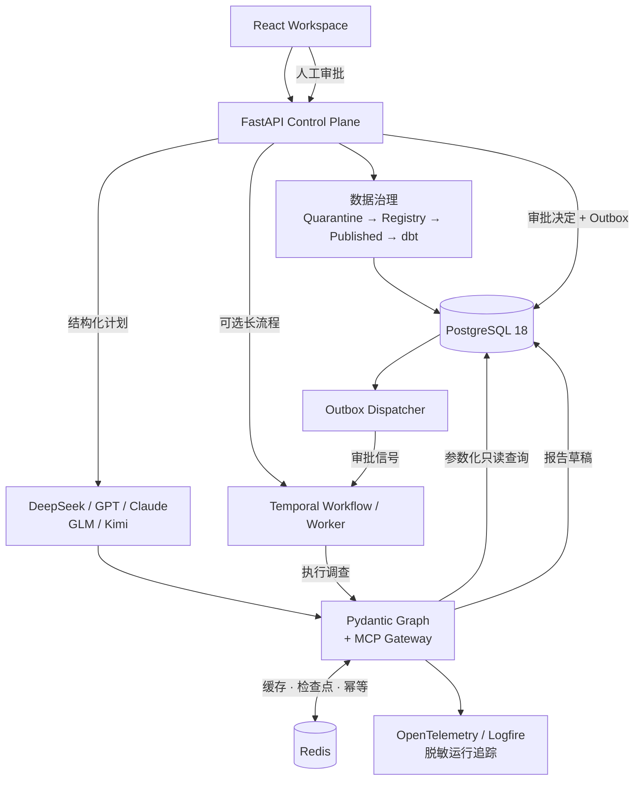

# InsightFlow Clinical Graph

> Governed Autonomous Clinical Investigation Agent（受治理的临床自主调查智能体）

InsightFlow Clinical 不是“给数据库套一个聊天框”，也不是让 LLM（大模型）自由生成 SQL。它把临床问题转成一个可复核的 Investigation（调查）：识别指标、读取已发布数据版本、生成假设、调用受治理工具、寻找支持与反证、披露缺失数据，最后输出 Evidence Chain（证据链）和待审批结论。

当前公开版本：**V3 / Graph Edition**。公开版本把内部迭代收敛为三个产品阶段：V1 建立临床数据与治理底座，V2 建立可恢复的 PydanticAI / Pydantic Graph 运行时，V3（当前）完成 PostgreSQL 并发安全、纵向 EHR、隐私抑制和版本化 reference-range catalog。当前 Synthea 数据不携带经过审核的医学参考范围，因此未加载真实 catalog 时异常比例保持 `unknown`/`NULL`。数据目录说明见 [`docs/V15_DATA_CATALOG.md`](docs/V15_DATA_CATALOG.md)，运行时说明见 [`docs/V17_RUNTIME.md`](docs/V17_RUNTIME.md)，纵向 EHR 说明见 [`docs/V27_LONGITUDINAL_EHR.md`](docs/V27_LONGITUDINAL_EHR.md)，reference catalog 加载说明见 [`docs/V27_REFERENCE_RANGE_CATALOG.md`](docs/V27_REFERENCE_RANGE_CATALOG.md)。开发过程中的路线图、验收记录和临时排练资料不进入 GitHub 产品仓库。

## 一眼看懂

| 输入 | 系统实际做什么 | 输出 |
| --- | --- | --- |
| 任意临床研究问题 | LLM 只选择一个已注册工具；确定性程序执行参数化只读查询 | 结构化观测、假设状态、证据链、限制和结论 |
| CSV / Excel / JSON 等异构文件 | 隔离、画像、关系发现、数据域匹配、转换校验、审批和版本发布 | 可审计 Mapping Contract（映射合同）与 Published Batch（发布批次） |
| 研究注册、安全报告、合成 EHR | 按来源类别分开建模，不混为受试者级试验数据 | 研究元数据、安全信号或合成患者数据域 |

核心原则：**程序负责数字与治理，LLM 负责受约束的下一步决策和解释。**

## 它不是什么

- 不是 Text-to-SQL（自然语言转 SQL）工具；模型不能自由查询任意表。
- 不是个体诊疗系统；不得给出开始/停止用药、剂量或患者治疗建议。
- 不是因果证明机器；观察性安全报告只能用于 Signal Detection（信号发现）。
- 不是只能处理药物的固定数据库；Drug（药物）、Device（器械）、Procedure（手术/操作）、Behavioral（行为干预）是并列干预类型。
- 不是“任何文件上传后立刻都能回答任何问题”；文件可治理发布与拥有专用分析插件是两层能力。

## 调查闭环



模型不能绕过 Tool Registry（工具注册表）、Data Scope（数据范围）、Metric Definition（指标定义）、SQL Safety（SQL 安全）、Minimum Cell Size（小样本抑制）和 Approval Gate（审批门禁）。`no_data（无数据）` 与 `insufficient_data（数据不足）` 只能成为限制，不能被写成支持或反驳。

## 系统架构



两层数据表示避免“万能大表”：

1. Stable Clinical Core（稳定临床核心）保存研究、干预、终点和受试者分析需要长期稳定的概念。
2. Domain Plugins（数据域插件）通过 `domain_name + domain_version + validated JSONB payload` 扩展安全信号、EHR、器械、手术等形态；安装专用 mart/tool 后才获得对应分析能力。

## Data Understanding（数据理解）

导入生命周期：

```text
Upload（上传）
→ Quarantine（隔离）
→ Profile（画像）
→ Domain Mapping（数据域映射）
→ Validate（转换与规则校验）
→ Admin Approve（管理员批准）
→ Publish（版本化发布）
```

默认支持：Excel（XLSX）、CSV、TSV、JSON、JSONL。Parquet 与 SAS XPT 通过可选依赖启用。未知格式或未知业务表不会被 LLM 强行解释为现有临床域，而是保留为 `custom_candidate（待确认自定义域）`。

当前注册域包括：

- Trial / CDISC（试验与 CDISC）：`DM`、`ADSL`、`ADEFF`、`AE`、`LB`、`EX`。
- Stable Study Core（稳定研究核心）：`STUDY`、`INTERVENTION`、`OUTCOME`。
- Safety Signal（安全信号）：`FAERS_REPORT`、`FAERS_DRUG`、`FAERS_REACTION`。
- Synthetic EHR（合成电子病历）：`PATIENT`、`ENCOUNTER`、`CONDITION`、`MEDICATION`、`PROCEDURE`、`OBSERVATION`、`DEVICE`、`ALLERGY`、`CAREPLAN`、`IMMUNIZATION`、`IMAGING_STUDY`、`SUPPLY`。

映射只接受审核过的规范化别名。当前版本已移除危险的字符串后缀猜测——例如 `CITY` 不能再因为字符结尾相似而被映射成 `ETHNICITY`。

## Public Data Validation（公开数据验收）

V16 使用五类性质不同的公开来源，下载文件保存在 git 忽略的 `.data/`，不把大体量样本和外部数据重新发布到仓库。本机当前快照已扩容；数量是实际验收值，不是接口总量：

| 来源类别 | 来源 | 本次实测 | 使用边界 |
| --- | --- | ---: | --- |
| Study Registry（研究注册元数据） | ClinicalTrials.gov（全球筛选） | 100,000 项研究，937,640 行规范化记录；2 行缺少必填字段被拒收并保留审计文件 | 可分析研究设计与干预构成，不能替代受试者级结果 |
| China Study Registry（中国地点研究元数据） | ClinicalTrials.gov `location=China` | 42,242 项研究，441,179 行规范化记录；2 行缺少必填字段被拒收并保留审计文件 | 代表研究中心在中国的注册元数据，不代表中国受试者级疗效 |
| FDA Label（药品监管标签） | openFDA Drug Labels | 10,000 份标签 | 可核对适应证、禁忌、警告和标签不良反应；不能替代诊疗建议 |
| Safety Signal（真实去标识化安全信号） | openFDA FAERS（2020–2024 分段样本） | 50,000 份报告，387,626 行规范化记录 | 不证明药物—反应因果，也不能估算发生率；每年只取请求上限 |
| Synthetic Patient（官方合成患者样例） | Synthea | 108 名合成患者，102,808 行已注册记录（完整快照含 201,657 行，6 个账单文件仍隔离） | 可做工程兼容测试，不代表真实患者或真实疗效 |
| Subject-level Trial Fixture（受试者级临床试验夹具） | 本地可复现合成数据 | 3,000 名受试者；6,000 条 Week-4/Week-12 结局；36,000 条给药记录 | 仅用于验证治疗组比较、缺失、依从性和中心下钻；不是网上下载的真实患者数据 |

以上公开快照已经通过“下载—规范化—映射—校验—治理发布”。跨全球与中国地点快照重叠的研究会在 `mart_study_registry` 按研究编号去重，当前数据库目录显示 132,991 项唯一研究、10,000 份标签、12,188 种 FAERS 药物和 108 名合成患者；公开数据批次共 1,879,253 条规范化记录。原始文件保存在本机 `.data/`，不进入仓库。

受试者级临床试验夹具已单独扩容到 3,000 名，避免常用总体/地区/治疗组问题因随机格子小于 10 而全部被抑制；`SITE-18/control` 仍刻意保留为不足 10 的格子，用于验证小样本保护不会被绕过。该夹具与公开注册元数据、FAERS 和药品标签严格分开，不能把注册信息当成疗效结果。

```powershell
$env:PYTHONPATH="backend"
python scripts/fetch_public_clinical_data.py --studies 100000 --skip-faers --skip-labels --skip-synthea
python scripts/fetch_china_clinical_data.py --studies 42242
python scripts/fetch_faers_partitioned.py --per-period 10000
python scripts/fetch_openfda_labels.py --labels 10000
python scripts/validate_public_clinical_data.py
docker compose --profile tools run --rm --entrypoint python generator scripts/publish_public_clinical_data.py
docker compose --profile tools run --rm dbt build --quiet
docker compose --profile tools run --rm --entrypoint python generator -m scripts.seed_clinical_trial --participant-count 3000 --scenario site_17 --reset
docker compose --profile tools run --rm dbt build --quiet
```

公开快照审计脚本使用更大的本地文件上限（250 MB），只适用于这些 allow-listed（允许来源）快照；交互式用户上传仍按 API 的 10 MB 限制执行。FAERS 分段脚本是为了绕过 openFDA 单查询 `skip` 限制，每个日期段都记录在 `scope.json`。

数据定义依据：[ClinicalTrials.gov API Study Data Structure](https://clinicaltrials.gov/data-api/about-api/study-data-structure)、[CDISC SDTM](https://www.cdisc.org/standards/foundational/sdtm)、[openFDA Drug Adverse Event API](https://open.fda.gov/apis/drug/event/)、[Synthea Downloads](https://synthetichealth.github.io/downloads.html)。

## V17–V25 Typed Runtime（强类型、可恢复与企业化边界）

V17 现在是同步 API 和动态后台 Job/Worker 的默认运行时；V16 仅保留为带 owner/reason/expiry 的显式应急回退。设置 `INSIGHTFLOW_RUNTIME_VERSION=v16` 并按 [`docs/V16_EMERGENCY_FALLBACK.md`](docs/V16_EMERGENCY_FALLBACK.md) 配置窗口（或让持久化 Job 携带 `runtime_version=8`）才会走旧循环；同一个 `/api/v8/clinical/investigations` 接口默认走下面的受约束链路：

```text
用户问题
→ PydanticAI 输出 InvestigationPlan（结构化调查计划）
→ PlanValidator 校验任务、指标、维度和数据域
→ Pydantic Graph 执行 route / context / plan / hypothesis / tool / observation / coverage / report 节点
→ MCP-compatible Gateway 再次校验工具、参数和只读 SQL
→ PostgreSQL 事实查询
→ Evidence Chain（证据链）与审批门禁
```

图节点只传递 `InvestigationGraphState`，模型没有 SQL 入口。V18 通过 `INSIGHTFLOW_RUNTIME_PORTS=memory|redis` 选择内存或 Redis 端口；Redis 只用于短期缓存、检查点、事件和幂等锁，不能作为临床事实库。V19 增加脱敏 OpenTelemetry/Logfire 适配器、版本绑定的审批恢复令牌和可注册的 Temporal Workflow/Worker 外壳；V20 再把 Activity、独立 Worker、工作流启动和令牌保护的审批恢复接口接通；V21 增加审批发件箱、重试、取消和超时，使跨 PostgreSQL 与 Temporal 的边界可恢复；V22 由独立 `clinical-temporal-outbox` 进程自动轮询并投递审批信号，并提供可选的本地 Temporal Server、Temporal UI 与 Temporal 专用 PostgreSQL；V23 增加工作流状态查询和 Activity 重试幂等；V25 把 Graph 检查点前移到节点级，并对事件做脱敏，恢复时复用计划和完成任务。完整迁移边界和回退方式见 [`docs/V17_RUNTIME.md`](docs/V17_RUNTIME.md)、[`docs/V18_DURABLE_RUNTIME.md`](docs/V18_DURABLE_RUNTIME.md)、[`docs/V19_ENTERPRISE_RUNTIME.md`](docs/V19_ENTERPRISE_RUNTIME.md)、[`docs/V20_TEMPORAL_OPERATIONS.md`](docs/V20_TEMPORAL_OPERATIONS.md)、[`docs/V21_DURABLE_OPERATIONS.md`](docs/V21_DURABLE_OPERATIONS.md)、[`docs/V22_TEMPORAL_DEPLOYMENT.md`](docs/V22_TEMPORAL_DEPLOYMENT.md)、[`docs/V23_TEMPORAL_RESILIENCE.md`](docs/V23_TEMPORAL_RESILIENCE.md) 与 [`docs/V25_RUNTIME_RESUME_REPLAY.md`](docs/V25_RUNTIME_RESUME_REPLAY.md)。

## LLM Provider（大模型供应商）

动态调查支持 `fake（本地确定性）`、OpenAI、Claude、DeepSeek、GLM、Kimi 和自定义 OpenAI-compatible Provider（兼容供应商）。密钥只写入本地 `.env`，不得提交 Git。

真实 LLM 返回的计划、动作和报告草稿还要经过 Pydantic Contract（结构合同）、PlanValidator（计划校验）和 Tool Registry（工具白名单）。V16 已修复 DeepSeek 选择 `search_clinical_metrics` 后返回列表、而运行时错误地假定所有工具都有 `.rows` 的协议不一致；现在指标检索会统一包装成结构化工具结果，并产生中性的 `metric_context（指标上下文）` 观测。V17 的 DeepSeek/OpenAI/GLM/Kimi/自定义兼容模型通过 PydanticAI 的 typed output（类型化输出）适配器接入，Claude 通过原生 Anthropic provider 接入；没有配置密钥时会明确报错，不会静默退回假数据。

## 产品版本（Product Versions）

| 版本 | 产品阶段 | 主要能力 | 状态 |
| --- | --- | --- | --- |
| V1 | Clinical Data Foundation | PostgreSQL、dbt、临床指标、CDISC 导入与发布、数据域插件、SQL 安全、小样本抑制和审批 | 已完成 |
| V2 | Governed Agent Runtime | 动态调查、问题编译、证据链、数据目录、PydanticAI + Pydantic Graph、MCP-compatible Gateway、Redis / Temporal 可恢复边界 | 已完成 |
| V3 | Graph Clinical Platform | Graph 节点检查点与重放、PostgreSQL 事务/CAS/并发安全、Temporal outbox、纵向 EHR 聚合、隐私审计、版本化 reference-range catalog | **当前版本** |

内部 V 编号只用于实现迁移和文档定位；公开产品以 V1、V2、V3 三个版本维护。项目路线图属于开发管理资料，不放进产品 UI；左侧“数据目录”可直接查看实际发现的字段和指标候选。

## 当前能验收的问题

启动后访问 `http://localhost:55173/`，进入“动态调查”，可尝试：

试验不再要求手工猜编号：系统先按当前身份返回可访问的默认治理试验；选择已发布批次后，试验选项自动切换为该批次内的试验。资源不存在、无权访问或批次不匹配时，页面会给出可操作的中文说明。

- `为什么本试验的 Week-12 治疗效果下降？`
- `治疗组与对照组的结局缺失是否存在差异？`
- `哪些研究中心的数据质量最异常？`
- `严重不良事件近期是否增加？`
- `访视窗口偏离是否集中在特定中心？`
- `糖尿病队列血糖按月趋势，2025-01-01 至 2025-03-31`
- `糖尿病队列血红蛋白按周趋势，2025-01-01 至 2025-03-31`

如果所选发布批次缺少 `AE / EX / LB` 等域，正确行为是明确报告 Data Gap（数据缺口），不是跨版本补数据或编造答案。公开数据已经完成“下载—规范化—映射—校验—治理发布”和对应分析插件接入，可从调查空间选择后输入不同问题。

纵向 EHR 结果始终按 UTC 时间桶和 10 人最小披露阈值聚合。当前 Synthea OBSERVATION 不包含审核过的参考范围，所以异常比例默认显示为 `unknown`/不可用；如有经审核的来源，可按 [`docs/V27_REFERENCE_RANGE_CATALOG.md`](docs/V27_REFERENCE_RANGE_CATALOG.md) 加载 catalog，并在 API 请求中传入 `reference_catalog_version`。

第二轮 DeepSeek 实机验收记录属于开发审计资料，不放进产品 UI，也不上传到产品仓库；需要复盘时在 Codex 侧边栏打开本机 Markdown。动态调查页仍可输入未预设的新问题；验收记录不会限制模型可处理的问题。

V15 目录验收：打开页面左侧“数据目录”，选择 `TRIAL-CF-101`，应看到实际发现的 `ADEFF / ADSL / AE / DM / EX` 数据域、记录数、字段类型和指标/维度候选。也可以直接调用 `GET /api/v15/clinical/catalog?trial_id=TRIAL-CF-101`；返回中不应出现患者行或 `payload_json`。

## 本地运行

```powershell
Copy-Item .env.example .env
# V17 已是默认值；仅需回退旧运行时时显式设置 v16
# $env:INSIGHTFLOW_RUNTIME_VERSION="v16"
docker compose up -d --build postgres backend clinical-worker frontend
```

如需验收 V22/V23 的真实 Temporal 运行路径，按 [`docs/V23_TEMPORAL_RESILIENCE.md`](docs/V23_TEMPORAL_RESILIENCE.md) 启动 `temporal` profile；默认同步 API 不需要这些服务。

查看状态：

```powershell
docker compose ps
Invoke-RestMethod http://127.0.0.1:18000/ready
```

完整临床验收（测试文件保留在开发工作区，不随公开源码上传）：

```powershell
powershell -ExecutionPolicy Bypass -File .\scripts\verify.ps1
```

开发自检：

```powershell
$env:PYTHONPATH=".;backend"
python -m compileall -q backend/app data_generator
cd frontend
npm run build
```

## 核心目录

```text
backend/app/clinical/       Agent Runtime、工具、数据理解、发布与校验
backend/app/clinical/v17_*  V17 强类型状态、Graph、MCP 网关与评测
backend/app/clinical/redis_ports.py / temporal_boundary.py  V18 可恢复端口与工作流边界
backend/app/clinical/temporal_workflow.py  V19 Workflow/Worker 定义
backend/app/clinical/temporal_activity.py / temporal_api.py / temporal_worker.py  V20 Activity、控制接口与 Worker 入口
backend/app/clinical/temporal_outbox.py / temporal_boundary.py / temporal_workflow.py  V21 发件箱、取消、重试与超时
backend/app/clinical/temporal_outbox_worker.py  V22 自动发件箱投递器
backend/app/clinical/temporal_boundary.py / temporal_activity.py / temporal_workflow.py  V23 状态查询与重试幂等
infra/temporal/dynamicconfig/            V22 本地 Temporal 开发配置
backend/Dockerfile.temporal             V20–V22 可选 Temporal Worker 镜像
backend/app/clinical/telemetry.py           V19 脱敏 OpenTelemetry 边界
backend/app/enterprise/approval.py           V19 审批恢复令牌
semantic/clinical_*.yml     受治理指标与版本化数据域
database/init/              PostgreSQL 幂等迁移
warehouse/models/           dbt staging / core / marts
frontend/src/clinical/      调查与数据理解工作台
scripts/                    下载、验收和运维脚本
examples/                   可上传的合成 CDISC 样例
```

旧 V0–V4 中确认不再被运行时、Docker、测试或脚本依赖的代码，以及分散的旧版本文档，已保存在本机 `archive/` 中；该目录不会进入新的 GitHub 仓库。仍被当前运行时依赖的早期基础代码继续留在主路径，不能只按文件名中的版本号误删。

## 安全边界

- 项目仅用于临床研究数据工程与受治理分析演示，不构成医疗建议。
- `.env`、API Key、数据库口令、`.data/` 和本地归档都不会提交。
- FAERS 报告里的药物与反应是报告内共现，不能解释为逐一因果配对。
- Synthetic Data（合成数据）可以验证工程链路，不能用于声称真实临床疗效。

贡献规范见 [`CONTRIBUTING.md`](CONTRIBUTING.md)，安全问题请参考 [`SECURITY.md`](SECURITY.md)。

