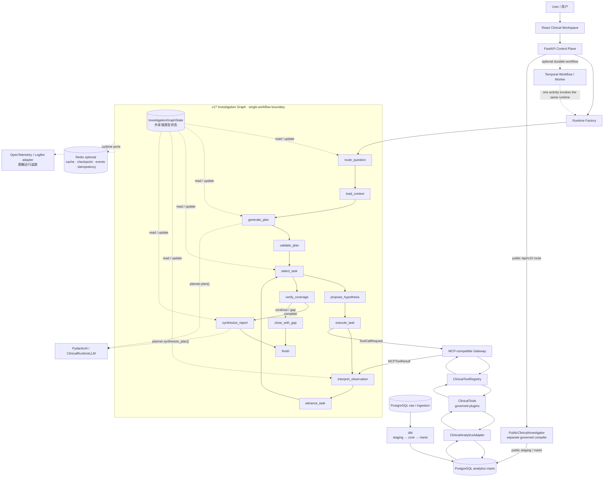
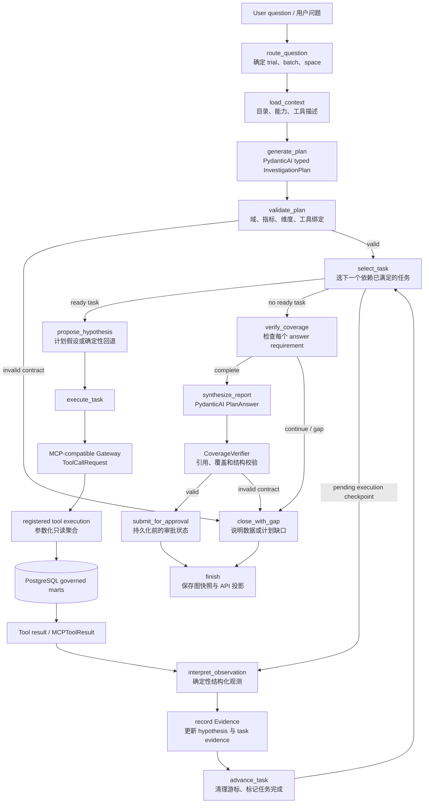

# InsightFlow Clinical Graph 架构说明

本文档以当前仓库代码为准，描述一次临床调查从请求进入到报告持久化的真实边界。它不是未来路线图：如果代码没有实现某项能力，本文档不会把它写成已实现能力。

## 1. 组件边界

| 组件 | 在当前实现中的职责 | 不负责什么 |
| --- | --- | --- |
| FastAPI Control Plane（控制平面） | 接收动态调查请求、解析试验/批次/数据域、选择运行时、持久化结果；也提供公开数据和 Temporal 接口 | 不在请求处理器里执行自由 SQL，也不代替 Graph 推理 |
| Pydantic Graph（调查图） | 通过真实的 Graph Node 管理顺序、分支、循环、检查点和结束条件 | 不是数据库，也不是 LLM 本身 |
| `InvestigationGraphState`（共享状态） | 保存计划、任务游标、待执行调用、观测、覆盖决策、数据缺口、事件和版本；每个节点读取并更新同一强类型状态 | 不是一个执行节点；它不主动决定下一步 |
| PydanticAI / `ClinicalRuntimeLLM` | 在 `generate_plan` 生成强类型 `InvestigationPlan`，在 `synthesize_report` 生成强类型 `PlanAnswer` | 不控制整个图，不生成 SQL，不绕过权限或工具白名单 |
| PlanValidator / CoverageVerifier / SQL Policy | 对计划绑定、域和指标维度、证据覆盖、引用和只读 SQL 做确定性校验 | 不凭模型文字猜测数据事实 |
| MCP-compatible Gateway（进程内工具边界） | 描述可用工具，检查域门控和参数，调用注册表并复核工具返回的 SQL | 不自行选择工具；工具选择/绑定来自计划和校验后的图逻辑 |
| ClinicalToolRegistry / ClinicalTools | 提供已注册的临床分析能力，执行固定参数的聚合操作 | 不接受模型传入的任意 SQL |
| PostgreSQL Adapter / PostgreSQL | 适配规范化的临床查询并保存原始/导入数据、dbt 模型、证据和图状态 | 不负责 LLM 推理 |
| dbt | 从 PostgreSQL source schema 构建 staging、core、marts | 不是调查运行时的请求中间件 |
| Temporal（可选） | 在外层提供持久工作流、重试、超时、审批信号和取消；一个 activity 调用现有调查运行时 | 不保存临床事实，不做 LLM 推理 |
| Redis（可选） | 通过 runtime ports 保存短期缓存、图检查点、运行事件和幂等声明 | 不是临床事实库或证据库 |
| OpenTelemetry / Logfire（可选） | 以脱敏属性记录运行观测；默认是 Noop | 不接收问题全文、患者行、SQL 或证据正文 |

## 2. 系统架构

这张图回答“系统由哪些组件组成、它们是什么关系”。图中只有一个逻辑 Investigation Graph 边界；工具调用离开图后由网关和注册工具执行，再把受治理结果返回图内。

### 图的读法

1. `FastAPI → Runtime Factory` 只负责组装和启动运行时。默认 v17 请求进入同一个 Pydantic Graph；v16 是显式的紧急回退路径。
2. Graph 内部的节点沿着共享 `InvestigationGraphState` 工作。状态包含 `plan`、`completed_task_ids`、`task_cursor`、`pending_execution`、`observations`、`coverage`、`data_gaps` 和 `events` 等真实字段；旧 `InvestigationState` 只是 API 兼容投影。
3. 模型只作为两个 v17 节点的能力：`generate_plan` 调 `planner.plan()`，`synthesize_report` 调 `planner.synthesize_plan()`。假设文本在 `propose_hypothesis` 中来自计划或确定性回退；观测解释在 `interpret_observation` 中由确定性解释器完成。
4. `execute_task` 产生 `ToolCallRequest`。网关使用注册表作为事实源，做数据域、参数和只读 SQL 校验后调用 `ClinicalTools`；网关本身不根据 MCP 名称替模型做调查决策。
5. PostgreSQL 的 raw/ingestion 数据由 dbt 构建为 staging、core 和 marts，工具只查询受治理的 marts。证据和图状态也由企业仓库持久化在 PostgreSQL 中。
6. Redis、Telemetry 和 Temporal 用虚线表示可选外围能力。默认端口模式是 memory、默认 telemetry 是 Noop；Temporal 只在启用 profile/worker 时承担外层可靠执行。
7. `/api/v10/clinical` 的公开数据调查是独立的 `PublicClinicalInvestigator`，使用受限问题编译器和公开 marts，不应理解为 v17 Graph 的节点。

## 3. 一次 Investigation 的运行流程

这张图回答“一次问题到底怎么跑”。核心循环是：提出假设 → 执行动作 → 获得观察 → 形成证据 → 更新状态 → 选择下一项任务。当前实现会遍历计划中可执行的任务；它不是无限自动假设树。

### 分支、循环与“证据不足”的真实语义

- 任务级循环发生在 `advance_task → select_task`：每次工具调用只处理一个已验证任务，返回后记录观测和证据，再选择下一个就绪任务。
- `no_data`、`insufficient_data` 和低于最小披露阈值的测量值会被解释为不可归因或数据不足，不能被写成支持/反驳。剩余任务仍可继续执行；如果全部任务结束仍无法覆盖要求，`verify_coverage` 进入 `close_with_gap`，输出“不强行下结论”的状态。
- 当前 v17 Graph 不在 `verify_coverage` 之后自动生成新的计划或无限展开假设树；`PlanRevision`/旧 `decide` 属于运行时协议和 v16/遗留路径，并非 v17 Graph 的实际节点调用。
- `propose_hypothesis` 不是模型调用节点：计划中的 `AnalysisTask.hypothesis` 优先，缺省时使用确定性模板。这样假设可以审计，且不会凭空引入数据库没有的事实。
- `synthesize_report` 只接收已记录证据，生成 `PlanAnswer` 后由 `CoverageVerifier` 检查覆盖和引用；失败或缺口会保留证据并结束为 `inconclusive`/失败，不把模型文本直接当成事实。

## 4. State 如何贯穿 Graph

`InvestigationGraphState` 是图的共享状态信封，而不是普通节点。`pydantic_graph` 的 `GraphRunContext` 将它交给每个 `BaseNode`；节点执行后通过下一个节点类型把控制权交回图。当前状态的主要区域如下：

- 调查范围：`trial_id`、`published_batch_id`、`space`；数据域、工具能力和请求元数据写入状态的审计元数据区域，而不是额外的 Graph 节点。
- 计划执行：`plan`、`completed_task_ids`、`active_task_id`、`task_cursor`、`pending_execution`。
- 事实与覆盖：`observations`、`legacy.evidence`、`coverage`、`data_gaps`、`graph_task_evidence`。
- 审计与恢复：`events`、`checkpoint_version`、`state_version`、`enterprise_version`、审批/发布状态。

节点不把原始问题、SQL 或患者行塞进运行事件；事件接收严格的操作字段白名单。完整证据仍在受保护的 PostgreSQL 调查记录中，API 可以返回兼容的 legacy projection（旧状态投影）。

## 5. Tool Boundary 与数据流

计划只描述抽象的 operation、measure、dimensions、filters 和 capability。`PlanValidator` 把它绑定到当前已发布域可用的注册插件，并拒绝不存在的能力。随后：

1. `execute_task` 生成 `ToolCallRequest`。
2. `ClinicalMCPGateway.call()` 检查插件是否存在、必需域是否已发布、参数模型是否有效，并要求返回 `ClinicalToolResult`。
3. `ClinicalTools` 通过 `ClinicalAnalyticsAdapter` 执行固定参数的聚合。PostgreSQL 适配器生成参数化 SQL；模型从未获得自由 SQL 入口。
4. 网关复核返回的 SQL 策略并形成 `MCPToolResult`。
5. `interpret_observation` 将结果转成 `ToolObservation` 和 `Evidence`，再更新共享状态。

MCP-compatible Gateway 是标准化边界，不是第二套“智能路由大脑”；实际能力在注册的 Tools，数据事实在 PostgreSQL。

## 6. Temporal、Redis 与可观测性

### Temporal

`/api/v20/clinical/workflows` 在 Temporal 启用时接受已类型化的工作流输入。`InsightFlowClinicalWorkflow` 调用一个 `execute_clinical_investigation_activity`，活动复用同一个动态运行时；workflow 负责重试、开始/结束超时、审批/取消信号和状态查询。Temporal 查询只返回编排元数据，证据不会搬到 Temporal。

同步 `/api/v8/clinical/investigations` 不需要 Temporal。两条路径共享调查执行代码，不存在第二个独立 Graph。

### Redis

`INSIGHTFLOW_RUNTIME_PORTS=redis` 时，runtime ports 将缓存、图 checkpoint、运行事件和幂等声明写入 Redis，并带命名空间与 TTL。PostgreSQL 仍是临床事实、证据和企业图快照的权威存储；Redis 不能替代它。

### OpenTelemetry / Logfire

默认使用 `NoopTelemetry`。启用 OTEL 适配器（`logfire` 是配置别名）后，只记录运行节点、状态、耗时、计数和错误类型等操作属性。脱敏白名单会丢弃问题正文、查询、SQL、参数、行和观测正文，因此它是可观测性通道，不是证据通道。

## 7. 公开数据路径不是 v17 Graph

`/api/v10/clinical` 的四个公开空间（研究注册、药品标签、安全信号、合成 EHR）由 `PublicClinicalQuestionCompiler` 和 `PublicClinicalInvestigator` 处理。它们使用受限的公开工具查询 PostgreSQL 的 public staging/marts；跨来源药品安全问题可执行受治理的方法组合，纵向 EHR 有单独的强类型编译器。外部模型（如启用）只能在允许的工具范围内路由/合成，不能改变空间边界或生成 SQL。该路径与 v17 Graph 的 `InvestigationGraphState`、节点和检查点是分开的，README 不应把两者画成同一条运行链。

